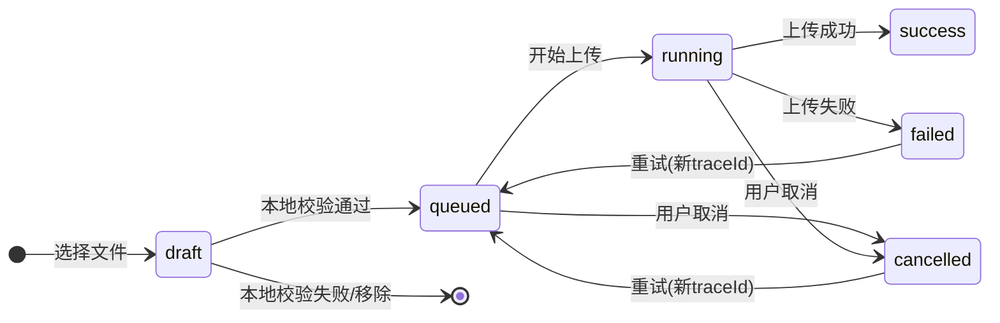

# imgstar 架构书

**版本**：v1.3
**状态**：方案冻结（可讨论修订）
**参考标准**：ISO/IEC/IEEE 42010-2011（架构框架与描述）
**日期**：2026-03-30

---

## 1. 业务背景与目标

### 1.0 文档治理（方案冻结，可讨论修订）

- `packages/contracts` + `docs/architecture/decisions`（ADR）是唯一契约源（若 `decisions/` 尚未落地，以本文第 14 章 ADR 为准）
- `docs/architecture/talk/*` 归档为历史讨论材料，不作为当前实现依据
- `docs/architecture/talk/ui.md` 可作为交互灵感输入，最终交互规则以本文 5.4、5.5、6.5 为准

### 1.1 产品定位

imgstar 是一款面向普通用户的轻量化图片上传工具，主打**降低无效回源成本**。

核心价值：
- 最小配置即可使用（填入 Key 即可）
- 防止缓存穿透与编号枚举
- 全链路可观测（请求级 traceId 追踪）

### 1.2 用户画像

| 角色 | 优先级 | 需求 |
|------|--------|------|
| 普通用户 | P0 | 填 Key 上传，无需复杂配置 |
| 高级用户 | P1 | 按需开启 WAF、插件等高级功能 |

### 1.3 MVP 边界

**做**：
- 上传编排（选择文件 → 预处理 → 编号预占 → 上传 → 结果记录）
- 图片预览与 hash 校验
- 插件扩展（Hook 机制）
- 多语言与深浅主题

**不做**（MVP 非目标）：
- 统一多厂商能力并集抽象
- 默认业务鉴权
- Rust 外部进程插件

---

## 2. 架构原则

### 2.1 设计原则

| 编号 | 原则 | 说明 |
|------|------|------|
| AP-01 | KISS | 桌面 App 场景固定，无需响应式跳变 |
| AP-02 | 最小惊讶 | 行为可预测，错误信息明确 |
| AP-03 | 领域自治 | 各模块边界清晰，独立演化 |
| AP-04 | 轻量化优先 | 不引入不必要的抽象层 |

### 2.2 技术约束

```
窗口最小尺寸：800 x 600
默认窗口尺寸：960 x 640
技术栈：Tauri + Vue3
持久化：heed (LMDB) + Tauri window state
```

### 2.3 领域真源约束（Hard Rule）

```
Rust 领域层（src-tauri/src/domain）是真源
前端仅做状态映射与交互编排，不复制领域判定
跨端字段与事件以 packages/contracts 为准
packages/domain 完全弃用：代码库中不允许存在该目录
前端接口模式：
  apps/desktop  →  Tauri commands（src-tauri/src/commands）
                →  packages/contracts（纯 DTO / 事件）
                严禁创建 packages/domain（违反即 CI 阻断）
```

### 2.4 分层依赖规则（Hard Rule）

```
apps/desktop  →  packages/contracts + Tauri commands （允许）
packages/domain 目录 → 禁止存在（扫描到即失败）
packages/contracts  →  ∅ （仅含类型定义）
src-tauri/src/commands  →  src-tauri/src/domain + src-tauri/src/runtime （允许）
src-tauri/src/domain  →  src-tauri/src/runtime + src-tauri/src/storage （允许）
```

---

## 3. 系统上下文

### 3.1 外部实体

```
┌─────────────────────────────────────────────────────────┐
│                     imgstar                             │
│  ┌─────────┐  ┌──────────┐  ┌────────┐  ┌──────────┐  │
│  │  用户   │  │ Cloudflare│  │  插件  │  │  外部    │  │
│  │         │  │   R2     │  │  生态  │  │  存储    │  │
│  └─────────┘  └──────────┘  └────────┘  └──────────┘  │
└─────────────────────────────────────────────────────────┘
```

### 3.2 上游依赖

| 依赖项 | 用途 | 约束 |
|--------|------|------|
| Cloudflare R2 | 对象存储后端 | MVP 仅支持 R2 |
| heed (LMDB) | 本地 KV 持久化 | 编号分配、名称映射、日志 |
| tokio | 异步运行时 | Rust 侧 |
| vue-i18n / rust-i18n | 国际化 | 首批 zh-CN / en |

---

## 4. 架构概述

### 4.1 模块视图

```
┌──────────────────────────────────────────────────────────────────┐
│                         apps/desktop                             │
│  ┌────────────────────────────────────────────────────────────┐ │
│  │ AppShell: 页面路由、全局 Provider、主题与语言初始化         │ │
│  └────────────────────────────────────────────────────────────┘ │
│  ┌───────────┐  ┌───────────┐  ┌───────────┐  ┌────────────────┐ │
│  │  Upload   │  │  Preview  │  │  Plugins  │  │   Settings     │ │
│  │  Page     │  │  Page     │  │  Page     │  │   Page         │ │
│  └───────────┘  └───────────┘  └───────────┘  └────────────────┘ │
└──────────────────────────────────────────────────────────────────┘
                              │
                              ▼
┌──────────────────────────────────────────────────────────────────┐
│                     src-tauri/src/domain                         │
│  ┌────────────┐  ┌────────────┐  ┌───────────┐  ┌─────────────┐ │
│  │  Upload    │  │  Preview   │  │  Settings │  │  Logging    │ │
│  │  Orchestr. │  │  Module    │  │  Model    │  │  Event Mod. │ │
│  └────────────┘  └────────────┘  └───────────┘  └─────────────┘ │
└──────────────────────────────────────────────────────────────────┘
                              │
                              ▼
┌──────────────────────────────────────────────────────────────────┐
│                     src-tauri/src/runtime                        │
│  ┌─────────────────┐  ┌──────────────────┐  ┌─────────────────┐ │
│  │  PluginRuntime  │  │  AdapterRuntime  │  │  EventBus       │ │
│  │  (Hook 调度)    │  │  (厂商适配)      │  │  (事件分发)     │ │
│  └─────────────────┘  └──────────────────┘  └─────────────────┘ │
└──────────────────────────────────────────────────────────────────┘
                              │
                              ▼
┌──────────────────────────────────────────────────────────────────┐
│                     src-tauri/src/storage                         │
│  ┌─────────────────┐  ┌──────────────────┐  ┌─────────────────┐ │
│  │  KeyAllocator   │  │  NameMapping     │  │  LogStore       │ │
│  │  (heed/LMDB)   │  │  Store (heed)     │  │  (heed)         │ │
│  └─────────────────┘  └──────────────────┘  └─────────────────┘ │
└──────────────────────────────────────────────────────────────────┘
```

### 4.2 核心模块职责

| 模块 | 职责 | 关键边界 |
|------|------|----------|
| AppShell | 页面路由、全局状态挂载 | 不直接访问存储适配器 |
| UploadOrchestrator | traceId 生成、Hook 串行执行、失败中止 | 输出任务状态流 |
| KeyAllocator | 编号预占、状态机、位数校验 | 仅输出合法 Object Key |
| PluginRuntime | Hook 统一注册与执行 | 按 hook_type 分发 |
| StorageAdapterRuntime | 厂商适配器加载与调用 | 统一调用接口 |
| PreviewModule | 图片预览、hash 校验（默认开启） | MVP 仅支持图片 |
| LogCenter | 请求级日志、筛选、导出 | traceId 贯穿全链路 |
| I18nCenter | 语言包加载、键值回退 | 回退链：用户 → zh-CN → en |
| ThemeCenter | 语义 Token、深浅切换 | CSS variable 注入 |

---

## 5. 上传链路（核心流程）

### 5.1 主流程
注意这里用户开启了两个插件1.隐性水印  2.图片压缩
```
用户选择文件
      │
      ▼
[UploadOrchestrator] 生成 traceId
      │
      ▼
Hook 执行（pre_key 串行，按 priority 排序）
      │  ┌─────────────────┐
      │  │  图片压缩 Hook  │
      │  │  隐性水印 Hook  │
      │  └─────────────────┘
      ▼
[KeyAllocator] 编号预占 → reserved
      │
      ▼
[PluginRuntime] Hook 执行（post_key 串行，只读 objectKey）
  │  ┌──────────────────────┐
  │  │  统计/审计类 Hook    │
  │  └──────────────────────┘
  ▼
[StorageAdapterRuntime] 调用 R2 上传
      │
      ▼
编号状态: reserved → active
      │
      ▼
[NameMappingStore] 记录映射
      │
      ▼
[LogCenter] 记录 upload:task_success
```

说明：
- `pre_key` 阶段 Hook 在 key 分配前执行，不可依赖 `objectKey`。
- 需要 `objectKey` 的插件逻辑应放在 `post_key` 阶段（只读上下文）。

### 5.2 异常处理与重试

**重试矩阵**（幂等性 × 错误类型）：

| 操作 | 是否幂等 | 自动重试 | 退避策略 | 最大尝试 | 重试条件 |
|------|----------|----------|---------|---------|----------|
| adapter_putObject（R2） | 是 | 是 | 指数 300ms | 3 | 网络 / 超时 / 限流 |
| key_allocation | 是 | 否 | - | 1 | 本地事务，失败即终止 |
| hook_process（pre_key / post_key） | 否 | 否 | - | 1 | 需插件声明 idempotent |
| adapter_complete_multipart | 否 | 否 | - | 1 | 有副作用，不重试 |

**退避参数**：首次 300ms，乘数 2.0，最大 30s；在“最大尝试 = 3”时，实际重试间隔为 `300ms → 600ms`（共 2 次重试）

**重试错误码**：仅 `ADAPTER_NETWORK_ERROR`、`ADAPTER_TIMEOUT`、`ADAPTER_RATE_LIMITED` 会触发重试

#### 5.2.1 阶段失败行为

| 阶段 | 失败码示例 | 行为 | 状态落点 |
|------|------------|------|----------|
| `hook_process(pre_key)` | `HOOK_EXECUTION_FAILED` / `HOOK_TIMEOUT` | 立即中止任务，记录 `upload:hook_error` | `failed` |
| `key_allocation` | `KEY_ALLOCATION_FAILED` | 中止任务，不进入上传阶段 | `failed` |
| `hook_process(post_key)` | `HOOK_EXECUTION_FAILED` / `HOOK_TIMEOUT` | 中止任务并释放 `reserved` 编号 | `failed` |
| `adapter_putObject` | `ADAPTER_NETWORK_ERROR` / `ADAPTER_TIMEOUT` / `ADAPTER_RATE_LIMITED` | 按 5.2 重试，耗尽后失败 | `failed` |
| `name_mapping_write` | `NAME_MAPPING_WRITE_FAILED` | 标记任务失败，写入补偿队列并触发对象清理 | `failed` |

补偿结果写入 `upload:task_failed` 的 `context.cleanupStatus` 字段，避免出现“失败不可追踪”。

### 5.3 编号状态机

```
free → reserved → active → deleted → cooling → free
                     ↑
                   (复用)
```

约束：
- 仅 `active` 可被外部访问
- `reserved/deleted/cooling` 在边缘层拦截
- 任务在 `reserved` 阶段失败时可回滚为 `free`（不进入 `active`）
- 回收链路在“云端删除 + 缓存清除请求”完成后立即执行 `deleted → cooling → free`，不等待 CDN 实际传播完成
- 禁止基于日期/时间分片生成公开 Object Key（已废弃）

### 5.3.1 回收链路（冻结）

回收是一个业务上的原子化过程，回收成功前不得进入最终 `free` 状态。执行顺序如下：

1. 由 `number`、`objectKey`、`fileName`、`traceId` 发起回收请求。
2. 先将本地编号状态从 `active` 标记为 `deleted`，避免继续参与新任务分配。
3. 立即同步 WAF active object regex guard，让已回收编号在云端删除完成前就退出可访问集合；连续编号区间按正则压缩，不做逐项穷举，避免规则长度耗尽。
4. 调用对象存储删除对象（云端删除）。
5. 若配置了 `zoneId` / `zoneApiToken` / `cdnBaseUrl`，则根据对象公开 URL 发出 CDN 缓存清除请求；此处以“请求已成功受理”为完成条件，不等待 CDN 传播完成。
6. 云端删除与缓存清除请求链路完成后，立即执行 `deleted → cooling → free`，允许后续复用。
7. 任一步失败时，不得进入 `free`；需要保持或回滚到安全状态，并在结果中写入对应 `cleanupStatus`。

### 5.4 上传页交互状态机（冻结）

```text
文件级状态机：
draft → queued → running → success
                   ├→ failed
                   └→ cancelled

failed → queued（用户重试，生成新 traceId）
cancelled → queued（用户重试，生成新 traceId）
```

### 5.4.1 Mermaid 状态图（上传文件）



| 用户动作 | 前置条件 | 前端交互行为 | 后端行为 | 事件/日志 |
|----------|----------|--------------|----------|-----------|
| 选择文件（拖拽/点击） | 无 | 列表新增 `draft` 行；通过本地校验后转 `queued` | 无 | 本地校验失败写 UI 错误提示 |
| 开始上传 | 至少 1 个 `queued` | 按钮进入 loading；每行显示进度条 | 调用 `cmd_upload_start`；进入 Orchestrator | `upload:task_created`、后续链路事件 |
| 取消单文件 | 行状态为 `queued/running` | 行状态转 `cancelled`，按钮变为“重试” | 调用 `cmd_upload_cancel` | `upload:task_cancelled` |
| 重试失败/取消项 | 行状态为 `failed/cancelled` | 行状态重置为 `queued` 并清空旧进度 | 重新调用 `cmd_upload_start`，分配新 `traceId` | 新一轮 `upload:*` 事件 |
| 清空列表 | 无 `running` 行 | 清空上传列表与本地缓存进度 | 无 | 写本地 UI 操作日志 |

交互约束：
- 有 `running` 行时，禁用“清空列表”与目标存储切换。
- “开始上传”仅在存在 `queued` 行时可点击。
- 同一行任务在完成前不允许重复点击“开始”。

### 5.5 反馈闭环与导航跳转（冻结）

| 反馈通道 | 触发条件 | 行为 |
|----------|----------|------|
| 状态栏 | 上传任务开始/结束 | 实时更新上传计数与连接状态 |
| 行内状态 | `queued/running/success/failed/cancelled` | 进度条 + 状态文本同步更新 |
| Toast-成功/信息/警告 | 非致命事件 | 右上角弹出，3s 自动消失 |
| Toast-错误 | 失败事件（如 `upload:task_failed`） | 不自动消失，提供“查看详情”入口 |

错误跳转规则：
- 用户点击错误 Toast 的“查看详情”后，路由跳转到 DevTools 日志页。
- 跳转时自动带入 `traceId` 过滤条件，并将 `level` 设为 `WARN/ERROR`。

---

## 6. 数据流与边界契约

约束：跨端 DTO 必须为可序列化结构，禁止直接使用浏览器原生 `File/Blob` 作为契约字段。

```typescript
type UploadFileRef = {
  path: string;
  name: string;
  size: number;
  mimeType?: string;
};


### 6.1 UploadOrchestrator

**输入**：
```typescript
{
  files: UploadFileRef[],
  target: StorageTargetConfig,
  pluginChain: PluginConfig[]
}
```

**输出**：
```typescript
{
  traceId: string,
  status: 'queued' | 'running' | 'success' | 'failed',
  error?: ErrorCode
}
```

### 6.2 KeyAllocator

**输入**：
```typescript
{
  fileType: string,
  keyPattern: string,  // 仅允许稳定命名空间，如: img/{namespace}/{number}.{ext}
  digitCount: number   // 默认 9 位
}
```

**输出**：
```typescript
{
  objectKey: string,   // 如: img/public/000000123.jpg（禁止日期分片）
  number: string       // 如: 000000123
}
```

### 6.3 PluginRuntime

**输入**：
```typescript
{
  hookContext: {
    file: UploadFileRef,
    traceId: string,
    stage: 'pre_key' | 'post_key',
    objectKey?: string, // pre_key 不提供，post_key 才可读取
    config?: object
  },
  hookType: 'upload' | 'preview' | 'security'
}
```

**输出**：
```typescript
{
  buffer?: BinaryPayload,  // 修改后的文件内容
  metadata?: object,     // 元数据注解
  error?: ErrorCode
}
```

### 6.4 StorageAdapterRuntime

**输入**：
```typescript
{
  objectKey: string,
  file: BinaryPayload,
  metadata?: object
}
```

**输出**：
```typescript
{
  success: boolean,
  adapterName: string,
  responseTime: number,
  adapterErrorCode?: string
}
```

WAF 同步约束（冻结）：
- WAF 表达式必须同时约束 `http.host == cdnBaseUrl.host` 与 `http.request.uri.path starts_with <cdnBaseUrl.path + /img/public/>`。
- WAF 规则生成必须基于 active 对象集合做连续编号区间压缩；同一前缀与后缀下的连号必须合并为正则范围，禁止暴力穷举逐项写入规则。
- 当 `cdnBaseUrl` 缺失或非法时，WAF 同步必须返回 `INVALID_CONFIG`，禁止下发仅按路径匹配的宽泛规则。

回收时的 CDN 清理约束：
- 回收开始后必须先同步 WAF，再调用 CDN cache purge；两者都必须基于同一份 `cdnBaseUrl`、`zoneId`、`zoneApiToken` 配置。
- CDN purge 以单文件公开 URL 为粒度，不得直接按目录级别粗粒度清除。
- 回收成功后，本地状态才允许从 `cooling` 进入 `free`，从而进入下一轮编号复用。

### 6.5 页面级交互逻辑（冻结）

全局交互骨架：
- 侧边栏固定宽度，主内容区结构不随窗口缩放改变。
- 页面切换采用统一淡入淡出过渡（默认 200ms）。
- 状态栏常驻，显示连接态与上传/下载计数。

| 页面 | 关键交互 | 状态定义 | 约束 |
|------|----------|----------|------|
| 上传页 | 拖拽/选择文件、开始、取消、重试、清空 | `draft/queued/running/success/failed/cancelled` | 规则以 5.4、5.5 为准 |
| 预览页 | 左侧文件列表选择、主预览区展示、元信息面板 | `idle/loading/ready/error` | 返回页面时保留上次选中项；`preview.hash.enabled=true` 时显示 hash 校验结果 |
| 插件页 | 启用/停用插件、安装插件、切换高级模式 | `disabled/enabled/error` | 启用前必须通过签名校验；失败时回滚到 `disabled` 并提示错误 |
| 设置页 | 编辑凭证与参数、保存、离开页面 | `pristine/dirty/saving/saved/error` | `dirty` 状态下离开页面需二次确认；保存前做字段校验 |
| DevTools 日志页 | 条件筛选、暂停/继续、导出、清空 | `live/paused` | 至少支持 `module/level/traceId/时间范围` 四类筛选 |

跨页跳转规则：
- 错误 Toast 的“查看详情”统一跳转 DevTools，并自动写入 `traceId` 过滤。
- 设置页存在未保存修改时，跳转任意页面前必须显示确认弹窗。

---

## 7. 事件模型（可观测契约）

说明：默认仅记录结构化元数据；事件 payload（如调试上下文）仅在开发模式且显式开关开启时记录。

### 7.1 事件结构

```typescript
interface UploadEvent {
  traceId: string;           // UUID
  timestamp: string;         // ISO8601
  module: string;            // 'upload' | 'plugin' | 'storage'
  eventName: string;         // 见 7.2
  status: 'success' | 'failed' | 'skipped';
  errorCode?: string;
  errorMessage?: string;
  duration: number;          // 毫秒
  context: object;
}
```

开发模式可选字段（默认关闭）：

```typescript
interface UploadEventDebugPayload {
  enabled: boolean;
  contextPayload?: object;   // 仅开发模式可选，生产默认禁用
}
```

### 7.2 事件清单（方案冻结，可讨论修订）

质量门禁统计口径：**14 个必测事件 = 上传域 11 个 + 插件签名域 3 个**。

| 事件名 | 触发时机 |
|--------|----------|
| `upload:task_created` | 用户确认上传 |
| `upload:key_allocated` | 编号预占成功 |
| `upload:hook_before_process` | Hook 执行前 |
| `upload:hook_after_process` | Hook 执行后 |
| `upload:hook_error` | Hook 执行失败 |
| `upload:adapter_start` | 适配器调用开始 |
| `upload:adapter_success` | 适配器返回成功 |
| `upload:adapter_error` | 适配器返回错误 |
| `upload:task_success` | 任务完成 |
| `upload:task_failed` | 任务失败 |
| `upload:task_cancelled` | 用户取消 |
| `plugin:signature_verified` | 签名源绑定校验通过 |
| `plugin:signature_rejected` | 签名源绑定校验失败 |
| `plugin:signature_revoked` | 插件签名源被吊销 |

- `upload:progress_report` 为高频可选观测事件，默认采样记录，不计入 14 个门禁事件。
- `upload:waf_sync_error` 为扩展观测事件（WAF 同步失败），默认记录，不计入 14 个门禁事件。
- `upload:hook_*` 事件的 `context` 必须包含 `stage`（`pre_key` / `post_key`）。

### 7.3 日志筛选维度

| 维度 | 说明 |
|------|------|
| module | upload / plugin / storage |
| level | INFO / WARN / ERROR / DEBUG |
| traceId | 请求级追踪 |
| errorCode | 错误码 |
| 时间范围 | 起止时间 |

---

## 8. 插件信任模型

### 8.1 MVP 安全边界（方案冻结，可讨论修订）

- 不做复杂风控分级与权限弹窗
- 仅做插件“同插件名 + 同签名源”绑定校验（加载前校验、启动时校验）
- MVP 最小运行约束：仅允许 `hook_type=upload`、单阶段插件数上限 16、`priority >= 0`、重复插件 ID 拒绝执行
- 绑定校验不通过即拒绝加载

### 8.2 插件 Manifest 契约

```json
{
  "id": "string",
  "name": "string",
  "version": "string",
  "apiVersion": "string",
  "signature": "source-binding-token",
  "signatureAlgorithm": "source_binding",
  "signer": "source-binding-authority",
  "signerSource": "signer-source-identity"
}
```

### 8.3 签名源绑定信任模型

**实现方式**：
- 官方插件：内置 `pluginId -> signerSource` 映射，签名源必须匹配内置白名单
- 社区插件：首次校验通过后建立 `pluginId -> signerSource` 绑定，后续同名插件必须使用同一签名源
- 吊销机制：维护签名源吊销列表；命中吊销即拒绝

**信任根**：
- MVP 以“官方 signerSource 白名单 + 本地绑定表”作为信任根
- 后续可扩展为远端签名源登记与轮转服务

**密钥轮转**：
- 签名源变更需要先完成显式迁移（更新白名单或绑定关系）
- 未迁移前若同名插件来源变化，必须拒绝

### 8.4 校验事件（计入 7.2 的 14 个门禁事件）

| 事件名 | 触发时机 | 额外字段 |
|--------|----------|----------|
| `plugin:signature_verified` | 签名源绑定校验通过 | `signer`, `signerSource`, `expiresAt` |
| `plugin:signature_rejected` | 签名源绑定校验失败 | `reason`, `signerSource` |
| `plugin:signature_revoked` | 签名源或插件被吊销 | `revokedAt` |

---

## 9. 技术选型

### 9.1 Rust/Tauri 侧

| 库 | 用途 |
|----|------|
| `tokio` | 异步运行时 |
| `tracing` + `tracing-subscriber` | 结构化日志 |
| `heed` | LMDB 嵌入式 KV |
| `reqwest` | HTTP 客户端（R2 适配） |
| `serde` + `serde_json` | 序列化 |
| `regex` | WAF 正则匹配 |
| `thiserror` | 统一错误类型 |
| `uuid` | traceId 生成 |
| `libloading` | 动态库加载（非 MVP，默认关闭） |
| `sequoia-pgp` | GPG 签名校验 |

### 9.2 前端侧

| 库 | 用途 |
|----|------|
| `vue` 3.x | 核心框架 |
| `vue-router` | 路由 |
| `pinia` | 状态管理 |
| `vue-i18n` | 国际化 |
| `tailwindcss` | 样式 |

---

## 10. 目录结构（目标态）

说明：以下为目标目录结构，当前仓库可按 Phase 分阶段落地，未出现目录视为待创建。

```
imgstar/
├── apps/
│   └── desktop/                      # Tauri 桌面应用
│       ├── src/
│       │   ├── app/                  # AppShell、路由、全局 Provider
│       │   ├── pages/                # upload / preview / plugins / settings / devtools
│       │   ├── widgets/              # 跨页面复用 UI 组件
│       │   ├── theme/                # 主题 token 与深浅模式
│       │   ├── i18n/                 # 语言包
│       │   └── styles/               # tailwind 与全局样式
├── src-tauri/                         # Rust/Tauri 后端
│   └── src/
│       ├── commands/                  # Tauri command 暴露
│       ├── domain/                    # 领域逻辑（真源）
│       ├── runtime/                   # 插件/适配器/事件运行时
│       ├── storage/                   # heed/LMDB 存储层
│       └── infra/                     # 基础设施
├── packages/
│   └── contracts/                     # 跨包契约
│       └── src/
│           ├── events.ts
│           ├── hook.ts
│           └── error-codes.ts
├── docs/
│   └── architecture/                 # 架构文档
│       └── decisions/                # ADR 记录
└── scripts/                          # 构建脚本
```

### 10.1 Rust 文件命名规范

#### 模块与包

| 类型 | 命名规范 | 示例 |
|------|----------|------|
| crate 根目录 | `src-tauri/` | `src-tauri/src/main.rs` |
| 模块文件 | `snake_case.rs` | `src-tauri/src/commands/mod.rs` |
| 模块目录 | `snake_case/` | `src-tauri/src/commands/` |
| lib.rs 入口 | `lib.rs` | `src-tauri/src/lib.rs` |

#### Rust 源文件内部

| 类型 | 命名规范 | 示例 |
|------|----------|------|
| 模块声明 | `pub mod name;` | `pub mod upload;` |
| 结构体 | `PascalCase` | `struct UploadTask` |
| 枚举体 | `PascalCase` | `enum TaskStatus` |
| Trait | `PascalCase` | `trait StorageAdapter` |
| 函数 | `snake_case` | `fn allocate_key()` |
| 常量 | `SCREAMING_SNAKE_CASE` | `const MAX_RETRY_COUNT` |
| 错误类型 | `PascalCaseError` | `UploadTimeoutError` |
| 配置结构 | `PascalCaseConfig` | `UploadConfig` |
| 事件结构 | `PascalCaseEvent` | `TaskCreatedEvent` |

#### Tauri Commands

```
src-tauri/src/commands/
├── mod.rs                    # 模块导出
├── upload.rs                # 上传相关命令
├── preview.rs               # 预览相关命令
├── settings.rs              # 设置相关命令
└── plugins.rs               # 插件相关命令
```

命令函数命名：`cmd_<resource>_<action>`

```rust
#[tauri::command]
async fn cmd_upload_start(ctx: CommandCtx, payload: UploadPayload) -> Result<trace_id::TraceId, Error>

#[tauri::command]
async fn cmd_upload_cancel(ctx: CommandCtx, trace_id: String) -> Result<(), Error>

#[tauri::command]
async fn cmd_preview_get(ctx: CommandCtx, key: String) -> Result<PreviewData, Error>
```

#### 内部模块组织

```
src-tauri/src/
├── main.rs                   # 入口，仅做 app 构建
├── lib.rs                    # 库入口，模块导出
├── commands/                 # Tauri command（暴露给前端）
│   ├── mod.rs
│   ├── upload.rs
│   ├── preview.rs
│   ├── settings.rs
│   └── plugins.rs
├── domain/                   # 领域逻辑（Rust）
│   ├── mod.rs
│   ├── upload/
│   │   ├── mod.rs
│   │   ├── orchestrator.rs   # 上传编排器
│   │   ├── task.rs          # 任务模型
│   │   └── error.rs         # 上传错误
│   └── preview/
│       ├── mod.rs
│       └── thumbnail.rs
├── runtime/                  # 运行时
│   ├── mod.rs
│   ├── plugin_runtime.rs     # 插件运行时
│   ├── adapter_runtime.rs   # 适配器运行时
│   └── event_bus.rs
├── storage/                  # 存储层 (heed/LMDB)
│   ├── mod.rs
│   ├── key_allocator.rs
│   ├── name_mapping.rs
│   └── log_store.rs
├── infra/                    # 基础设施
│   ├── mod.rs
│   ├── config.rs             # 配置加载
│   ├── i18n.rs              # 国际化
│   └── theme.rs             # 主题
└── error.rs                 # 全局错误定义
```

#### 命名冲突避免

- 前端类型后缀 `Type` / `Data` / `Payload`：`UploadPayload`、`PreviewData`
- Rust 类型不加后缀，直接用 `Upload`、`Preview`
- 前缀区分同名实体：`upload::Task` vs `preview::Task`（通过模块隔离）

#### import 规范

```rust
use imgstar_domain::upload::{UploadOrchestrator, UploadTask};  // 包级别
use crate::domain::upload::error::UploadError;                      // 本地相对导入
use super::super::storage::key_allocator;                          // 父级模块
```

---

## 11. i18n 与主题

### 11.1 国际化策略

- **首批语言**：zh-CN（简体中文）、en（英文）
- **回退链**：用户语言 → zh-CN → en
- **键值组织**：按模块命名空间（如 `upload.errors.*`）
- **实现方式**：半静态（构建期预编译 + 启动加载 + 运行期取值）

### 11.2 主题策略

| 主题 | 背景色 | 主文本 | 强调色 |
|------|--------|--------|--------|
| 深色 | #0F172A / #1E293B | #F8FAFC | #60A5FA |
| 浅色 | #F8FAFC / #FFFFFF | #1E293B | #3B82F6 |

约束：
- 深浅切换使用 CSS `transition`，不超过 300ms
- 颜色必须来自 Token，禁止硬编码

---

## 12. 错误码最小集合（方案冻结，可讨论修订）

### 12.1 通用

| errorCode | 说明 |
|-----------|------|
| `INTERNAL_ERROR` | 内部错误 |
| `INVALID_CONFIG` | 配置无效 |
| `SIGNATURE_VERIFY_FAILED` | 插件签名校验失败 |

### 12.2 编号与键

| errorCode | 说明 |
|-----------|------|
| `KEY_ALLOCATION_FAILED` | 编号分配失败 |
| `KEY_REUSE_CONFLICT` | 编号复用冲突 |
| `KEY_NOT_ACTIVE` | 编号未激活 |

### 12.3 Hook

| errorCode | 说明 |
|-----------|------|
| `HOOK_EXECUTION_FAILED` | Hook 执行失败 |
| `HOOK_TIMEOUT` | Hook 超时 |
| `HOOK_INVALID_OUTPUT` | Hook 输出无效 |

### 12.4 适配器

| errorCode | 说明 |
|-----------|------|
| `ADAPTER_NETWORK_ERROR` | 网络错误 |
| `ADAPTER_TIMEOUT` | 适配器超时 |
| `ADAPTER_AUTH_ERROR` | 认证错误 |
| `ADAPTER_RATE_LIMITED` | 限流 |
| `ADAPTER_SERVER_ERROR` | 服务器错误 |

### 12.5 上传流程

| errorCode | 说明 |
|-----------|------|
| `UPLOAD_CANCELLED` | 用户取消 |
| `UPLOAD_STAGE_TIMEOUT` | 阶段超时 |
| `UPLOAD_VALIDATION_FAILED` | 验证失败 |
| `PREVIEW_SOURCE_NOT_FOUND` | 预览源文件不存在或不可读取 |
| `NAME_MAPPING_WRITE_FAILED` | 名称映射写入失败 |

---

## 13. 默认配置值

| 配置键 | 默认值 | 说明 |
|--------|--------|------|
| `upload.timeout.key_allocation_ms` | 3000 | 编号分配超时 |
| `upload.timeout.hook_ms` | 60000 | Hook 执行超时 |
| `plugin.runtime.memory_limit_mb` | 256 | 插件运行内存上限 |
| `ui.sidebar.width_px` | 64 | 侧边栏固定宽度 |
| `ui.status_bar.height_px` | 32 | 状态栏固定高度 |
| `ui.page.transition_ms` | 200 | 页面切换淡入淡出时长 |
| `ui.toast.max_visible` | 3 | 同时显示的 Toast 上限 |
| `ui.toast.auto_hide_ms` | 3000 | 成功/信息/警告 Toast 自动消失时间 |
| `ui.table.row_height_px` | 32 | 列表最小行高 |
| `upload.timeout.adapter_ms` | 120000 | 适配器上传超时 |
| `upload.progress.report_interval_ms` | 1000 | 进度上报间隔 |
| `upload.progress.heartbeat_timeout_ms` | 15000 | 心跳超时 |
| `cdn.ttl.ms` | 900000 | CDN TTL 基线（15 分钟，可按实际配置） |
| `upload.reuse.delay_ms` | 900000 | 兼容字段；当前回收链路在删除与缓存清除请求完成后立即释放，不再等待 TTL |
| `waf.update.min_interval_ms` | 30000 | WAF 更新最小间隔 |
| `preview.hash.enabled` | true | hash 校验默认开启 |
| `log.event_payload.enabled` | false | 事件 payload 默认关闭 |
| `log.event_payload.dev_mode_only` | true | payload 仅开发模式可开启 |

---

## 14. 架构决策记录（ADR）

### ADR-001：采用单仓多包结构

**决策**：采用 monorepo 结构，`apps/` 与 `packages/` 平级
**理由**：轻量化工具链，多包协作需简化依赖管理
**状态**：方案冻结（可讨论修订）

### ADR-002：heed (LMDB) 替代文件存储

**决策**：本地存储全部使用 heed（LMDB）
**理由**：崩溃恢复可靠、嵌入式无需独立进程
**状态**：方案冻结（可讨论修订）

### ADR-003：MVP 仅支持 Cloudflare R2

**决策**：不预建 S3 适配器空壳
**理由**：轻量化优先，按需触发
**状态**：方案冻结（可讨论修订）

### ADR-004：移除 Astro，仅保留 Vue3 + Tauri

**决策**：前端技术栈移除 Astro
**理由**：桌面交互优先，减少构建复杂度与运行时心智负担
**状态**：方案冻结（可讨论修订）

### ADR-005：Rust 领域层为真源

**决策**：领域判定统一在 Rust 侧，前端仅状态映射
**理由**：避免双实现漂移，确保跨端语义一致
**状态**：方案冻结（可讨论修订）

### ADR-006：契约单一来源

**决策**：`packages/contracts` + ADR 为唯一契约源
**理由**：避免多份文档漂移
**状态**：方案冻结（可讨论修订）

---

## 15. 分阶段开发与 Gate 标准

### 15.1 五阶段规划与各阶段完成定义

**Phase 1: 目录骨架与契约冻结**
- 输入前置：无
- 完成定义：目录树建立、contracts 冻结、workspace 配置、首个 command 可调用
- 阻塞项：无

**Phase 2: 核心上传链路与插件运行时**  
- 输入前置：Phase 1 完成
- 完成定义：UploadOrchestrator、PluginRuntime（GPG 签名校验）、KeyAllocator、EventBus 完成；Rust 端到端测试通过
- 阻塞项：R2 适配器存根实现，插件签名公钥来源确定

**Phase 3: 本地存储与日志可观测**
- 输入前置：Phase 2 完成  
- 完成定义：LogStore、NameMappingStore 完成；日志面板功能完整；14 个事件全量测试通过
- 阻塞项：无

**Phase 4: 前端 UI 与跨端状态同步**
- 输入前置：Phase 3 完成
- 完成定义：AppShell、Upload Page、DevTools、i18n 完成；前后端 IPC 通道验证；E2E 快速路径通过
- 阻塞项：Tauri 信道可靠性

**Phase 5: 功能补齐与性能优化**  
- 输入前置：Phase 4 完成
- 完成定义：Preview、Plugins、Settings 页面完成；性能基线建立；全量 E2E 测试通过
- 阻塞项：无

### 15.2 质量关卡（Quality Gate）检查项

| 检查项 | 执行方式 | 通过条件 | 起始 Phase |
|--------|----------|----------|------------|
| 单元测试覆盖 | `cargo test` / `npm.cmd run test` | 关键路径 > 80% | 2 |
| 契约一致性 | 自动化对比 contracts 版本 | 无异步定义 | 2 |
| 错误码全量 | 枚举检查 × 实际抛出点 | 100% 映射 | 2 |
| 事件完整性 | 校验 14 个事件 | 所有字段齐全 | 3 |
| 签名验证 | GPG 签名测试（通过+失败+吊销） | 3/3 通过 | 2 |
| 编号状态机 | 6 态转移覆盖测试 | 全覆盖 | 2 |
| 依赖检查 | 分析包间导入 | 无循环依赖 | 1 |
| 端到端冒烟 | 最小路径 E2E | 成功率 100% | 4 |
| 性能基线 | 1MB 文件上传耗时 | < 5s（本地 mock） | 5 |
| i18n 覆盖 | 键值缺失检查 | 无白屏文案 | 4 |
| 交互一致性 | UI 状态机回放（上传/预览/设置/日志） | 关键状态无遗漏 | 4 |

说明：Quality Gate 的“性能基线”用于合并门禁（本地 mock）；16.1/17 的网络分档用于基准观测与回归分析。

### 15.3 交互验收清单（冻结）

| 编号 | 场景 | 操作步骤 | 预期结果 | 关联规则 |
|------|------|----------|----------|----------|
| UI-001 | 上传成功主路径 | 选择 3 个文件 → 点击开始上传 | 行状态依次进入 `queued/running/success`；状态栏上传计数变化；出现成功 Toast | 5.4 / 5.5 |
| UI-002 | 上传取消 | 文件进入 `running` 后点击取消 | 行状态变 `cancelled`；记录取消事件；按钮切为“重试” | 5.4 / 7.2 |
| UI-003 | 失败重试 | 人为触发上传失败后点击重试 | 行状态 `failed → queued → running`；生成新 `traceId`；旧进度清空 | 5.4 / 6.5 |
| UI-004 | 运行中禁用项 | 存在 `running` 行时观察按钮与目标切换 | “清空列表”与目标存储切换不可用 | 5.4 |
| UI-005 | 错误跳转日志 | 触发失败并点击错误 Toast 的“查看详情” | 跳转 DevTools；自动写入 `traceId` 过滤；`level` 默认 `WARN/ERROR` | 5.5 / 6.5 |
| UI-006 | 预览状态恢复 | 预览页选择文件后切到其他页再返回 | 保留上次选中项；`preview.hash.enabled=true` 时展示 hash 校验结果 | 6.5 / 13 |
| UI-007 | 插件启用失败回滚 | 启用签名不通过插件 | 插件状态回滚 `disabled`；出现错误提示 | 6.5 / 8.1 / 8.4 |
| UI-008 | 设置脏数据保护 | 设置页修改字段后直接切页 | 出现离开确认弹窗；取消后留在当前页，确认后才跳转 | 6.5 |
| UI-009 | 日志筛选最小能力 | 在 DevTools 分别设置 `module/level/traceId/时间范围` | 结果与筛选条件一致，可导出当前结果 | 6.5 / 7.3 |
| UI-010 | 主题与切页动效 | 切换主题并执行页面切换 | 主题切换过渡 <= 300ms；页面切换约 200ms，且无闪白 | 6.5 / 11.2 / 13 |

---

## 16. 测试体系与一键执行框架

### 16.1 测试分层与职责

测试按金字塔划分，从下而上：

**单元测试（Unit Tests）**
- 范围：单个函数、模块、Struct 的纯逻辑
- Rust 侧工具：`cargo test`（内置 Rust 测试框架 + proptest 做属性测试）
- 前端侧工具：Vitest（Vue 3 原生支持，快速反馈）
- 目标覆盖率：关键路径 > 80%
- 执行频率：每次提交自动运行（pre-commit hook）

**集成测试（Integration Tests）**
- 范围：多个模块协作，跨包依赖，真实存储（heed）
- Rust 侧：`cargo test --test '*'`（tests/ 目录下的集成测试）
- 前端侧：集成测试（Vitest，与真实 Tauri 通道交互）
- 场景：
  - UploadOrchestrator → KeyAllocator → LogStore 端到端链路
  - PluginRuntime 加载 GPG 签名验证
  - 14 个事件全量触发与持久化
- 执行频率：每日合并前（pre-merge）

**端到端测试（E2E Tests）**
- 范围：完整用户路径（UI → IPC → Rust → 存储）
- 工具：Playwright 或 Tauri WebdriverIO（模拟用户交互）
- 场景：
  - Phase 4 快速冒烟：文件选择 → 上传 → 进度显示 → 日志查看
  - Phase 5 完整路径：多文件 → 预览 → 插件管理 → 设置保存
  - 失败路径：错误 Toast 点击“查看详情” → 跳转 DevTools 并自动带入 traceId 筛选
  - 表单路径：设置页 `dirty` 状态下切页，必须出现确认弹窗
- 执行频率：每日完整运行 + 发版前

**性能基准测试（Benchmark Tests）**
- 范围：关键链路耗时与内存占用
- Rust 侧：criterion（精准的性能测试库）
- 前端侧：Lighthouse + 自定义 PerformanceAPI
- 关键指标：
  - KeyAllocator 单次分配耗时 < 1ms
  - 上传耗时分档：1MB < 5s、10MB < 20s、100MB < 120s（20Mbps 上行基线）
  - UI 响应延迟 < 100ms
  - 深浅主题切换 < 300ms
- 执行频率：每周 + 发版前，与基线对比

### 16.2 一键执行命令集

按 Phase 分层，测试人员直接复制粘贴执行。

说明：
- `make` 为可选封装；若本地无 `make`，可按各 Phase 的“包含的子任务”逐条执行。
- Windows 环境下 Node 命令建议使用 `npm.cmd`。
- 日志过滤优先使用 `rg`；PowerShell 可替代为 `Select-String`。

**Phase 1 - 契约冻结检查**
```
# 检查包依赖与目录结构
make verify-phase-1
```
产出：
- 无循环依赖报告
- contracts 完整性检查
- workspace 配置验证

**Phase 2 - 上传链路与签名**
```
# 运行单元 + 集成测试
make test-phase-2

# 包含的子任务：
#   - cargo test (Rust 单位测试)
#   - cargo test --test '*' (集成测试)
#   - npm.cmd run test:unit (前端单元)
#   - 签名验证测试（3 个用例）
```
产出：
- 单元测试覆盖率 > 80%
- 集成测试通过率 100%
- GPG 签名校验用例通过率 100%
- 错误码映射完整性报告

**Phase 3 - 日志与存储**
```
# 运行日志、存储相关测试
make test-phase-3

# 包含的子任务：
#   - LogStore CRUD 单元测试
#   - NameMappingStore 查询集成测试
#   - 14 个事件完整性验证
#   - heed 持久化集成测试
```
产出：
- 事件完整性报告（14/14 触发）
- 存储故障恢复测试报告
- 日志导出格式验证（JSON/CSV）

**Phase 4 - UI 与 IPC**
```
# 前端 UI + Tauri 通道测试
make test-phase-4

# 包含的子任务：
#   - npm.cmd run test (前端单元 + 集成)
#   - Tauri E2E 冒烟用例 (快速路径)
#   - i18n 覆盖检查
#   - 深浅主题切换性能测试
```
产出：
- 前端测试覆盖率报告
- E2E 快速路径通过率
- i18n 键值缺失报告
- 性能基线报告

**Phase 5 - 完整功能**
```
# 完整的单元 + 集成 + E2E + 性能测试
make test-full

# 或分解执行：
make test-unit      # 所有单元测试
make test-integration # 所有集成测试
make test-e2e       # 完整 E2E 路径
make test-benchmark # 性能基准
make test-coverage  # 汇总覆盖率
```
产出：
- 总体覆盖率报告（单位 + 集成）
- E2E 完整路径通过率
- 性能对比报告（vs 基线）
- 发版清单检查

### 16.3 测试框架与工具选型

**Rust 侧完整技术栈**

| 层级 | 工具 | 用途 | 配置位置 |
|------|------|------|---------|
| 单元测试 | cargo test（内置） | 模块单测 | src-tauri/src/lib.rs（#[cfg(test)]） |
| 属性测试 | proptest | 随机生成输入验证不变性 | src-tauri/Cargo.toml |
| 集成测试 | cargo test --test | 跨包协作测试 | src-tauri/tests/*.rs |
| 性能基准 | criterion | 精准的耗时与内存基准 | benches/*.rs |
| 覆盖率 | cargo tarpaulin | 代码覆盖率收集与报告 | CI/CD (GitHub Actions) |
| Mocking | mockall | 模拟 trait 与依赖 | src-tauri/Cargo.toml (dev) |
| 测试数据库 | tempfile + 独立 LMDB 目录 | 本地 heed 实例隔离 | src-tauri/tests |

**前端侧完整技术栈**

| 层级 | 工具 | 用途 | 配置位置 |
|------|------|------|---------|
| 单元测试 | Vitest | 快速单元测试（Vue 3 原生） | apps/desktop/vitest.config.ts |
| 组件测试 | Vue Test Utils | 组件交互与状态验证 | apps/desktop/tests/unit |
| 集成测试 | Vitest + @vitest/ui | 多组件流程测试 | apps/desktop/tests/integration |
| E2E 测试 | Playwright | 真实浏览器端到端 | apps/desktop/tests/e2e |
| 性能测试 | Lighthouse API + Perfume.js | 渲染与交互性能 | apps/desktop/tests/performance |
| 覆盖率 | nyc (istanbul) | 代码覆盖率收集 | CI/CD |
| Mock HTTP | msw (Mock Service Worker) | Tauri IPC Stub | apps/desktop/tests/mocks |

**跨端协作测试**

| 场景 | 工具 | 用途 |
|------|------|------|
| Tauri 命令验证 | tauri-specta | 自动生成类型化 IPC 和测试桩 | src-tauri/Cargo.toml + apps/desktop/ |
| 合约测试 | tauri-specta + JSON Schema snapshot | 前后端数据结构一致性 | packages/contracts + generated/contracts |
| 端到端冒烟 | Playwright + Tauri API | 点击 → IPC 调用 → 数据验证 | apps/desktop/tests/e2e/smoke.spec.ts |

合约快照治理：
- `generated/contracts` 定义为 CI 临时产物目录，不入库（应加入 `.gitignore`）。
- PR 阶段执行快照生成与一致性校验；若与 `packages/contracts` 推导结果不一致则阻断合并。
- 发版前需再次生成快照并归档到构建产物，作为可追溯记录。

### 16.4 测试报告与 CI/CD 集成

**报告类型与收集方式**

| 报告 | 生成工具 | 产物路径 | 消费方 |
|------|----------|---------|--------|
| 单元测试通过率 | cargo test + nyc | target/coverage/index.html | 开发者本地 |
| 集成测试日志 | 各框架 JSON 输出 | test-results/*.json | CI/CD Dashboard |
| 覆盖率汇总 | cargo tarpaulin + nyc | coverage/report-final.json | Codecov/SonarQube |
| 性能基准 | criterion + Lighthouse | bench-results/*.json | 性能对比页面 |
| E2E 失败截图 | Playwright artifacts | ./test-results/screenshots/ | 调试用 |

**CI/CD 钩子**

| 触发点 | 执行命令 | 通过条件 | 失败处理 |
|--------|---------|---------|---------|
| 每个 commit | make test-unit | 通过率 100% | 阻止提交 |
| Pull Request | make test-integration | 覆盖率 >= 80% | 注释到 PR |
| 每日定时 (22:00) | make test-full + benchmark | 性能 vs 基线无恶化 | 邮件告警 |
| 发版前 | make test-full + E2E | 所有检查通过 + 无高危警告 | 阻止上线 |

**本地开发工作流**

```text
开发者本地：
  git commit    →  pre-commit hook →  make test-unit  →  提交
  
代码审查阶段：
  push PR       →  GitHub Actions  →  make test-integration + coverage  →  结果注释到 PR
  
发版检查：
  merge master  →  tag release     →  make test-full + E2E  →  生成发版报告
```

### 16.5 测试覆盖率与关卡标准

**按 Phase 递进的覆盖率目标**

| Phase | 单元测试 | 集成测试 | E2E 覆盖 | 性能基准 |
|-------|---------|---------|---------|---------|
| 2 | > 80% 关键路径 | UploadOrchestrator/KeyAllocator 完整 | N/A | N/A |
| 3 | > 75% 整体 | LogStore/NameMappingStore + 14 事件 | N/A | KeyAllocator < 1ms |
| 4 | > 75% 整体 | 前后端 IPC | 快速路径 1 条 | UI 响应 < 100ms |
| 5 | > 80% 整体 | 所有集成路径 | 完整 3 条路径 | 性能 vs 基线对标 |

**覆盖率计算**

- Rust: cargo tarpaulin，统计行覆盖率
- 前端: nyc（Istanbul），统计行 + 分支 + 函数覆盖
- 跳过行标记: `#[cfg(test)] / // @coverage-ignore`，合理排除非关键代码
- 阈值：项目整体 >= 80%，单个模块 >= 70%

### 16.6 故障排查与本地 Debug

**常见问题自检清单**

| 问题 | 排查命令 | 预期输出 |
|------|---------|---------|
| 签名验证失败 | `make test-phase-2 2>&1 | rg -i signature` | 3/3 用例通过 |
| heed 数据损坏 | `make test-phase-3 -- -- --show-output` | 恢复成功 |
| i18n 键缺失 | `make test-phase-4 2>&1 | rg "missing keys"` | 0 缺失 |
| IPC 超时 | `make test-e2e -- --timeout=30000` | 超时 < 5% |
| 性能恶化 | `make test-benchmark --baseline=last` | vs 基线无下降 |

**本地性能 Profiling**

```
Rust:  cargo flamegraph --bench key_allocator
前端:  Chrome DevTools Performance tab
```

---

## 17. 质量属性与测试标准

| 属性 | 目标 | 验证方式 | 开始 Phase | 通过条件 |
|------|------|----------|-----------|----------|
| 可用性 | 填入 Key 即可上传 | E2E：拖拽 → 上传成功 → 日志查看 | Phase 4 | 1 次运行成功 |
| 可观测性 | traceId 贯穿全链路 | 自动化：14 个事件全量触发 + JSON 导出验证 | Phase 3 | 14/14 事件 ✓ |
| 可扩展性 | Hook 机制支持插件 | 集成测试：3 个官方 Hook（压缩/水印/hash）可加载运行 | Phase 5 | 3/3 Hook ✓ |
| 安全性 | GPG 签名校验 + WAF | 自动化：有效签名通过 + 无效签名拒绝 + 撤销密钥拒绝 | Phase 2 | 3/3 用例 ✓ |
| 国际化 | zh-CN / en 完整 | 自动化：i18n 键值覆盖检查 + UI 无白屏渲染 | Phase 4 | 100% 键覆盖 |
| 主题 | 深浅切换 < 300ms | 性能测试：CSS transition 耗时 | Phase 4 | ≤ 300ms |
| 性能 | 分档上传耗时达标 | 性能测试：1MB < 5s、10MB < 20s、100MB < 120s（20Mbps 上行基线） | Phase 5 | 3 档均达标 |
| 代码质量 | 关键路径 > 80% 覆盖 | 单元测试覆盖率报告（cargo tarpaulin / nyc） | Phase 2+ | ≥ 80% |
| 契约一致性 | 无异步定义 | 自动化：contracts 版本 vs 实际导入 | Phase 1+ | 100% 匹配 |
| 错误码映射 | 100% 覆盖 | 自动化：error-codes.ts vs 代码抛出点枚举 | Phase 2+ | 0 未映射 |
| 状态机 | 6 态转移全覆盖 | 单元测试：free→reserved→active→deleted→cooling→free | Phase 2 | 6/6 态 ✓ |
| 无循环依赖 | 包间依赖树 | 依赖检查工具（cargo-deny / npm-check） | Phase 1+ | 0 循环 |

---

## 18. 串行开发拆分（前端先行）

### 18.1 执行模式覆盖规则

- 本章覆盖第 15 章的实际执行顺序：采用“前端先行、后端跟进”的单主线串行模式。
- FE-GATE 未通过前，后端仅允许建立命令桩与类型编译链路，不进入领域逻辑实现。
- 前端阶段统一基于 `packages/contracts` + Mock Runtime 开发，禁止前端自行扩展领域判定。

### 18.2 前端阶段拆分（FE）

| 阶段 | 目标 | 完成定义（DoD） | 主要产出 |
|------|------|------------------|----------|
| FE-1 | AppShell 与导航骨架 | 侧边栏/主内容/状态栏骨架可运行；页面路由可切换 | `app`、`router`、布局组件 |
| FE-2 | 上传页主流程交互 | 覆盖 UI-001/002/003/004；状态机与按钮可用性符合 5.4 | Upload 页面与列表状态管理 |
| FE-3 | 预览/插件/设置页面 | 覆盖 UI-006/007/008；设置页 `dirty` 保护生效 | Preview/Plugins/Settings 页面 |
| FE-4 | DevTools 与错误跳转 | 覆盖 UI-005/009；错误 Toast 可跳转日志并带 `traceId` | DevTools 页面与筛选能力 |
| FE-5 | 主题/动效/i18n 收口 | 覆盖 UI-010；页面过渡与主题切换满足时长约束 | 主题 Token、动效与多语言接入 |
| FE-6 | 前端联调准备冻结 | 命令调用点、错误码映射、Mock 切换点冻结 | Frontend API Facade 与联调清单 |

### 18.3 FE-GATE（后端启动门槛）

满足以下条件才可进入 BE 阶段：

1. UI-001 至 UI-010 全部通过（Mock Runtime 环境）。
2. 前端命令调用面冻结：命令名、入参 DTO、出参 DTO、错误码映射已确认。
3. 交互一致性门禁通过（第 15.2 `交互一致性`）。
4. 前端高优先级缺陷（P0/P1）为 0。

### 18.4 后端阶段拆分（BE）

| 阶段 | 目标 | 完成定义（DoD） | 主要产出 |
|------|------|------------------|----------|
| BE-1 | Tauri 命令桩与类型对齐 | `cmd_upload_start/cancel` 等命令可调用，类型与 contracts 一致 | commands 基础骨架 |
| BE-2 | 上传核心链路 | UploadOrchestrator + KeyAllocator + 状态机可跑通 | domain/upload + storage/key_allocator |
| BE-3 | 存储适配与重试策略 | R2 适配器、重试退避、失败码映射符合 5.2 | runtime/adapter_runtime |
| BE-4 | 插件运行与签名校验 | Hook pre/post_key、签名验证事件完整 | runtime/plugin_runtime |
| BE-5 | 日志与可观测闭环 | 事件入库、筛选导出、`traceId` 链路完整 | event_bus + log_store |
| BE-6 | 真联调与回归 | 前端去 Mock，完成端到端与回归 | 联调报告与回归结果 |

### 18.5 串行开工清单（立即执行）

1. 创建前端骨架目录与路由壳（FE-1）。
2. 建立 Upload 页状态机与行级状态模型（FE-2）。
3. 建立统一 API Facade（先接 Mock，再切 Tauri）。
4. 建立 UI-001 到 UI-010 的自动化测试占位用例。
5. FE-GATE 达成后，按 BE-1 顺序接入真实命令。

---

## 19. 附录

### A. 参考文档

- [decisions/](decisions/)
- [talk/ui.md](talk/ui.md)（仅作交互灵感输入）

说明：`talk/*` 为历史讨论记录，已弃用，不作为当前实现依据。

### B. 术语表

| 术语 | 说明 |
|------|------|
| Object Key | 对象存储中的唯一标识符 |
| traceId | 请求级追踪 ID |
| Hook | 预处理/后处理扩展点 |
| heed | LMDB 的 Rust 封装库 |
| WAF | Web Application Firewall |

---

**文档结束**
