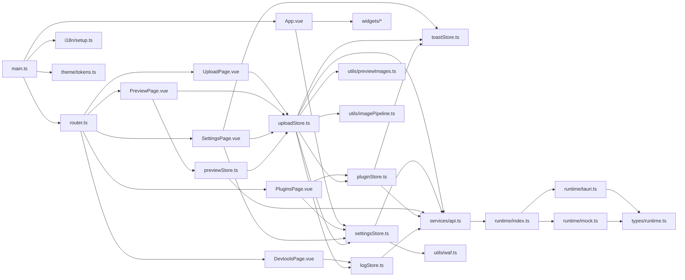
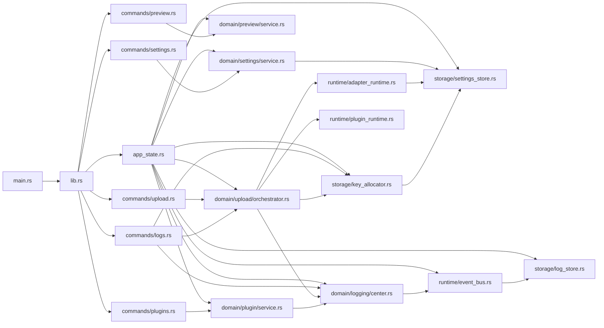
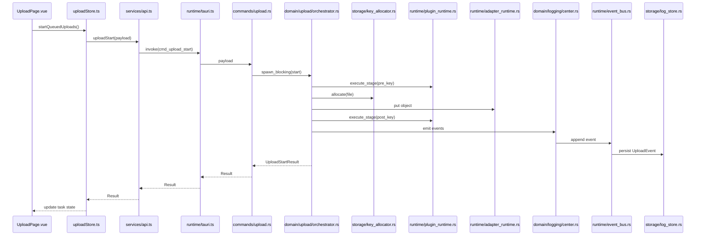

# UML 依赖关系分析报告 v1.0

**版本**：v1.0
**状态**：已生成
**粒度**：单文件
**日期**：2026-04-01
**范围**：当前实现（前端 `apps/desktop/src` + 后端 `src-tauri/src`）
**对齐参考**：
- [docs/architecture/architecture.md](../architecture.md#L1)
- [docs/architecture/talk/颗粒度对齐报告-v1.5.md](./颗粒度对齐报告-v1.5.md#L1)
- [docs/architecture/talk/waf-alignment-report.md](./waf-alignment-report.md#L1)

## 0. 阅读导航

- 先看第 1 节，快速把握结论。
- 再看第 2、3 节，分别确认前端和后端的文件级依赖链。
- 最后看第 4、5 节，确认跨端契约边界与审核结论。

## 1. 结论先行

当前实现的主干依赖关系是清晰的，且适合按单文件粒度建 UML 图：

- 前端主链路是启动文件、应用壳、路由、页面、状态层、服务层、运行时桥接层，再落到 Tauri 命令与共享契约。
- 后端主链路是入口、Tauri 容器、AppState 组装、命令外壳、领域服务、运行时、存储层，再回到共享契约。
- `packages/contracts` 是前后端共同依赖的唯一契约边界；`src-tauri/src/domain` 是 Rust 领域真源；前端只做状态映射和交互编排。
- UML 里最值得作为中心节点的文件是：`main.ts`、`App.vue`、`uploadStore.ts`、`settingsStore.ts`、`runtime/index.ts`、`runtime/tauri.ts`、`lib.rs`、`app_state.rs`、`upload/orchestrator.rs`、`adapter_runtime.rs`、`log/center.rs`、`settings_store.rs`。
- 目前没有看到明显的“页面直连后端实现”或“领域层反向依赖 UI”的结构，边界基本符合现有架构书。

## 2. 前端单文件依赖分析

### 2.1 启动与壳层

- [main.ts](../../../apps/desktop/src/main.ts#L1) 是前端入口，负责创建 Vue 应用、挂载 Pinia、路由、i18n 和主题初始化。
- [app/App.vue](../../../apps/desktop/src/app/App.vue#L1) 是应用壳，负责全局布局、主题切换、语言切换、路由容器和顶部/侧边组件编排。
- [app/router.ts](../../../apps/desktop/src/app/router.ts#L1) 只负责路由表，不承载业务逻辑。

### 2.2 页面到状态的单文件链路

- [pages/UploadPage.vue](../../../apps/desktop/src/pages/UploadPage.vue#L1) 直接依赖 [stores/uploadStore.ts](../../../apps/desktop/src/stores/uploadStore.ts#L1)，是上传主流程的 UI 入口。
- [pages/PreviewPage.vue](../../../apps/desktop/src/pages/PreviewPage.vue#L1) 依赖 [stores/previewStore.ts](../../../apps/desktop/src/stores/previewStore.ts#L1) 和 [stores/uploadStore.ts](../../../apps/desktop/src/stores/uploadStore.ts#L1)，用于从成功任务中构造预览视图。
- [pages/PluginsPage.vue](../../../apps/desktop/src/pages/PluginsPage.vue#L1) 依赖 [stores/pluginStore.ts](../../../apps/desktop/src/stores/pluginStore.ts#L1) 与 [stores/settingsStore.ts](../../../apps/desktop/src/stores/settingsStore.ts#L1)，同时读取后端快照接口。
- [pages/SettingsPage.vue](../../../apps/desktop/src/pages/SettingsPage.vue#L1) 依赖 [stores/settingsStore.ts](../../../apps/desktop/src/stores/settingsStore.ts#L1)、[stores/toastStore.ts](../../../apps/desktop/src/stores/toastStore.ts#L1) 和 [stores/uploadStore.ts](../../../apps/desktop/src/stores/uploadStore.ts#L1)。
- [pages/DevtoolsPage.vue](../../../apps/desktop/src/pages/DevtoolsPage.vue#L1) 依赖 [stores/logStore.ts](../../../apps/desktop/src/stores/logStore.ts#L1)，是日志/快照调试视图。

### 2.3 状态层与服务层

- [stores/uploadStore.ts](../../../apps/desktop/src/stores/uploadStore.ts#L1) 是前端最重的状态中枢，依赖 [services/api.ts](../../../apps/desktop/src/services/api.ts#L1)、[stores/logStore.ts](../../../apps/desktop/src/stores/logStore.ts#L1)、[stores/pluginStore.ts](../../../apps/desktop/src/stores/pluginStore.ts#L1)、[stores/settingsStore.ts](../../../apps/desktop/src/stores/settingsStore.ts#L1)、[stores/toastStore.ts](../../../apps/desktop/src/stores/toastStore.ts#L1)，以及预览和上传流水线工具。
- [stores/settingsStore.ts](../../../apps/desktop/src/stores/settingsStore.ts#L1) 负责设置标准化、WAF 规则构造和后端持久化入口，依赖 [services/api.ts](../../../apps/desktop/src/services/api.ts#L1) 与 [utils/waf.ts](../../../apps/desktop/src/utils/waf.ts#L1)。
- [stores/previewStore.ts](../../../apps/desktop/src/stores/previewStore.ts#L1) 依赖 [services/api.ts](../../../apps/desktop/src/services/api.ts#L1) 和 [stores/uploadStore.ts](../../../apps/desktop/src/stores/uploadStore.ts#L1)，说明预览视图是上传结果的下游消费者。
- [stores/pluginStore.ts](../../../apps/desktop/src/stores/pluginStore.ts#L1) 依赖 [services/api.ts](../../../apps/desktop/src/services/api.ts#L1)、[stores/toastStore.ts](../../../apps/desktop/src/stores/toastStore.ts#L1) 和 i18n 初始化，是插件开关与验证逻辑的前端汇聚点。
- [stores/logStore.ts](../../../apps/desktop/src/stores/logStore.ts#L1) 只依赖 [services/api.ts](../../../apps/desktop/src/services/api.ts#L1)，负责事件列表刷新和过滤。
- [services/api.ts](../../../apps/desktop/src/services/api.ts#L1) 是前端唯一的运行时 API 入口，所有调用都经过它，再落到运行时桥接层。

### 2.4 运行时桥接层

- [runtime/index.ts](../../../apps/desktop/src/runtime/index.ts#L1) 负责在 Tauri 和 mock 运行时之间切换，是前端的运行时选择器。
- [types/runtime.ts](../../../apps/desktop/src/types/runtime.ts#L1) 定义 [services/api.ts](../../../apps/desktop/src/services/api.ts#L1) 使用的 RuntimeBridge 接口，所有运行时实现必须对齐这里的能力面。
- [runtime/tauri.ts](../../../apps/desktop/src/runtime/tauri.ts#L1) 是生产路径的 IPC 适配器，直接映射到后端命令和共享契约。
- [runtime/mock.ts](../../../apps/desktop/src/runtime/mock.ts#L1) 是离线和开发路径的模拟实现，保持和 Tauri 同一接口面。

### 2.5 前端 UML 依赖图

### 2.6 前端审核要点

- 依赖方向是单向的：页面依赖 store，store 依赖 api，api 依赖运行时桥接，运行时桥接再依赖后端命令或 mock。
- [stores/uploadStore.ts](../../../apps/desktop/src/stores/uploadStore.ts#L1) 是前端最明显的高耦合节点，但它仍然是单向汇聚，不是循环依赖中心。
- [runtime/index.ts](../../../apps/desktop/src/runtime/index.ts#L1) 只是选择实现，不应在 UML 里画成业务层。
- [stores/previewStore.ts](../../../apps/desktop/src/stores/previewStore.ts#L1) 是 [stores/uploadStore.ts](../../../apps/desktop/src/stores/uploadStore.ts#L1) 的下游，不建议反向画箭头。

## 3. 后端单文件依赖分析

### 3.1 入口与容器

- [main.rs](../../../src-tauri/src/main.rs#L1) 只负责把执行流交给 [lib.rs](../../../src-tauri/src/lib.rs#L1)。
- [lib.rs](../../../src-tauri/src/lib.rs#L1) 创建 Tauri 容器、注册命令并注入 [app_state.rs](../../../src-tauri/src/app_state.rs#L1)。
- [app_state.rs](../../../src-tauri/src/app_state.rs#L1) 是后端的组合根，它把存储、运行时和领域服务组装起来。

### 3.2 命令层

- [commands/upload.rs](../../../src-tauri/src/commands/upload.rs#L1) 是上传命令外壳，start 通过阻塞线程执行编排，cancel 和 recycle 直接委托给 orchestrator。
- [commands/settings.rs](../../../src-tauri/src/commands/settings.rs#L1) 只是 settings service 的薄封装。
- [commands/logs.rs](../../../src-tauri/src/commands/logs.rs#L1) 把日志查询、清理和只读快照暴露给前端。
- [commands/plugins.rs](../../../src-tauri/src/commands/plugins.rs#L1) 负责插件验证。
- [commands/preview.rs](../../../src-tauri/src/commands/preview.rs#L1) 负责图片预览查询。

### 3.3 领域、运行时、存储

- [domain/upload/orchestrator.rs](../../../src-tauri/src/domain/upload/orchestrator.rs#L1) 是后端最核心的业务文件，直接依赖 KeyAllocator、AdapterRuntime、PluginRuntime 和 LogCenter。
- [domain/logging/center.rs](../../../src-tauri/src/domain/logging/center.rs#L1) 负责 traceId、事件组装和事件下发。
- [domain/settings/service.rs](../../../src-tauri/src/domain/settings/service.rs#L1) 负责配置验证、规范化与持久化。
- [domain/plugin/service.rs](../../../src-tauri/src/domain/plugin/service.rs#L1) 负责插件验证并记录日志。
- [domain/preview/service.rs](../../../src-tauri/src/domain/preview/service.rs#L1) 负责图片预览、hash 计算和 mime 推断。
- [runtime/event_bus.rs](../../../src-tauri/src/runtime/event_bus.rs#L1) 是事件到存储的单向通道。
- [runtime/plugin_runtime.rs](../../../src-tauri/src/runtime/plugin_runtime.rs#L1) 负责按 stage 执行插件链。
- [runtime/adapter_runtime.rs](../../../src-tauri/src/runtime/adapter_runtime.rs#L1) 负责对象存储适配，是 SettingsStore 的消费者。
- [storage/key_allocator.rs](../../../src-tauri/src/storage/key_allocator.rs#L1) 是编号分配和状态机持久层。
- [storage/log_store.rs](../../../src-tauri/src/storage/log_store.rs#L1) 是事件落盘层。
- [storage/settings_store.rs](../../../src-tauri/src/storage/settings_store.rs#L1) 是配置落盘层。
- [contracts.rs](../../../src-tauri/src/contracts.rs#L1) 提供命令、服务和前端共用的 DTO、枚举和事件类型。

### 3.4 后端 UML 依赖图

### 3.5 上传序列图

### 3.6 后端审核要点

- [app_state.rs](../../../src-tauri/src/app_state.rs#L1) 是组合根，不是业务逻辑文件，但它决定了整个后端依赖的装配方式。
- [commands/upload.rs](../../../src-tauri/src/commands/upload.rs#L1) 用阻塞线程包裹上传编排，说明编排器并不直接运行在 UI 异步上下文里。
- [domain/upload/orchestrator.rs](../../../src-tauri/src/domain/upload/orchestrator.rs#L1) 是最值得在 UML 里单独展开的方法级候选文件，因为它同时连接 key、plugin、adapter 和日志四条链路。
- [runtime/event_bus.rs](../../../src-tauri/src/runtime/event_bus.rs#L1) 到 [storage/log_store.rs](../../../src-tauri/src/storage/log_store.rs#L1) 是非常纯粹的单向写入链，适合作为独立箭头展示。
- [runtime/adapter_runtime.rs](../../../src-tauri/src/runtime/adapter_runtime.rs#L1) 依赖 [storage/settings_store.rs](../../../src-tauri/src/storage/settings_store.rs#L1)，说明对象存储适配和配置读取是绑定的，但它不应该反向依赖领域层。

## 4. 跨端契约边界

- 前端所有能力都通过 [services/api.ts](../../../apps/desktop/src/services/api.ts#L1) 进入运行时桥接，再进入 Tauri 命令，不存在页面直连后端实现的路径。
- 后端命令层只接收和返回共享契约中的 DTO，不直接向前端暴露 Rust 内部结构。
- `packages/contracts` 是唯一跨端共享层；当前工作区没有 `packages/domain` 目录，这一点与架构书的硬规则一致。
- 如果以后要继续细化 UML，建议只在契约层上画数据流，在 domain/runtime/storage 上画控制流，不要把两者混在一张图里。

## 5. 审核结论

从当前实现看，依赖关系是自洽的：前端负责状态和交互编排，后端负责命令、领域、运行时和存储，契约层负责跨端数据边界。整体上没有发现会破坏单文件粒度建图的结构性问题。

如果后续要正式出 UML 图，建议优先画三张图：

- 前端文件级依赖图。
- 后端组合根和命令/领域依赖图。
- 上传主流程序列图。

这三张图足以覆盖当前实现的主要依赖关系，而且不会把图画得过深。

## 6. 证据索引

- [apps/desktop/src/main.ts](../../../apps/desktop/src/main.ts#L1)
- [apps/desktop/src/app/App.vue](../../../apps/desktop/src/app/App.vue#L1)
- [apps/desktop/src/app/router.ts](../../../apps/desktop/src/app/router.ts#L1)
- [apps/desktop/src/pages/UploadPage.vue](../../../apps/desktop/src/pages/UploadPage.vue#L1)
- [apps/desktop/src/pages/PreviewPage.vue](../../../apps/desktop/src/pages/PreviewPage.vue#L1)
- [apps/desktop/src/pages/PluginsPage.vue](../../../apps/desktop/src/pages/PluginsPage.vue#L1)
- [apps/desktop/src/pages/SettingsPage.vue](../../../apps/desktop/src/pages/SettingsPage.vue#L1)
- [apps/desktop/src/pages/DevtoolsPage.vue](../../../apps/desktop/src/pages/DevtoolsPage.vue#L1)
- [apps/desktop/src/stores/uploadStore.ts](../../../apps/desktop/src/stores/uploadStore.ts#L1)
- [apps/desktop/src/stores/previewStore.ts](../../../apps/desktop/src/stores/previewStore.ts#L1)
- [apps/desktop/src/stores/pluginStore.ts](../../../apps/desktop/src/stores/pluginStore.ts#L1)
- [apps/desktop/src/stores/settingsStore.ts](../../../apps/desktop/src/stores/settingsStore.ts#L1)
- [apps/desktop/src/stores/logStore.ts](../../../apps/desktop/src/stores/logStore.ts#L1)
- [apps/desktop/src/services/api.ts](../../../apps/desktop/src/services/api.ts#L1)
- [apps/desktop/src/runtime/index.ts](../../../apps/desktop/src/runtime/index.ts#L1)
- [apps/desktop/src/runtime/tauri.ts](../../../apps/desktop/src/runtime/tauri.ts#L1)
- [apps/desktop/src/runtime/mock.ts](../../../apps/desktop/src/runtime/mock.ts#L1)
- [apps/desktop/src/types/runtime.ts](../../../apps/desktop/src/types/runtime.ts#L1)
- [apps/desktop/src/i18n/setup.ts](../../../apps/desktop/src/i18n/setup.ts#L1)
- [apps/desktop/src/theme/tokens.ts](../../../apps/desktop/src/theme/tokens.ts#L1)
- [apps/desktop/src/utils/waf.ts](../../../apps/desktop/src/utils/waf.ts#L1)
- [src-tauri/src/main.rs](../../../src-tauri/src/main.rs#L1)
- [src-tauri/src/lib.rs](../../../src-tauri/src/lib.rs#L1)
- [src-tauri/src/app_state.rs](../../../src-tauri/src/app_state.rs#L1)
- [src-tauri/src/commands/upload.rs](../../../src-tauri/src/commands/upload.rs#L1)
- [src-tauri/src/commands/settings.rs](../../../src-tauri/src/commands/settings.rs#L1)
- [src-tauri/src/commands/logs.rs](../../../src-tauri/src/commands/logs.rs#L1)
- [src-tauri/src/commands/plugins.rs](../../../src-tauri/src/commands/plugins.rs#L1)
- [src-tauri/src/commands/preview.rs](../../../src-tauri/src/commands/preview.rs#L1)
- [src-tauri/src/domain/upload/orchestrator.rs](../../../src-tauri/src/domain/upload/orchestrator.rs#L1)
- [src-tauri/src/domain/logging/center.rs](../../../src-tauri/src/domain/logging/center.rs#L1)
- [src-tauri/src/domain/settings/service.rs](../../../src-tauri/src/domain/settings/service.rs#L1)
- [src-tauri/src/domain/plugin/service.rs](../../../src-tauri/src/domain/plugin/service.rs#L1)
- [src-tauri/src/domain/preview/service.rs](../../../src-tauri/src/domain/preview/service.rs#L1)
- [src-tauri/src/runtime/event_bus.rs](../../../src-tauri/src/runtime/event_bus.rs#L1)
- [src-tauri/src/runtime/plugin_runtime.rs](../../../src-tauri/src/runtime/plugin_runtime.rs#L1)
- [src-tauri/src/runtime/adapter_runtime.rs](../../../src-tauri/src/runtime/adapter_runtime.rs#L1)
- [src-tauri/src/storage/key_allocator.rs](../../../src-tauri/src/storage/key_allocator.rs#L1)
- [src-tauri/src/storage/log_store.rs](../../../src-tauri/src/storage/log_store.rs#L1)
- [src-tauri/src/storage/settings_store.rs](../../../src-tauri/src/storage/settings_store.rs#L1)
- [src-tauri/src/contracts.rs](../../../src-tauri/src/contracts.rs#L1)
- [packages/contracts/src/index.ts](../../../packages/contracts/src/index.ts#L1)